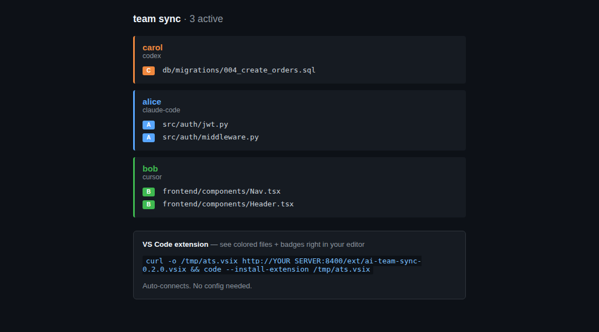

# ai-team-sync

Stop AI agents (and humans) from stepping on each other's work.

When two devs both tell their AI agents to change the same files, nobody knows until conflicting PRs appear. ai-team-sync gives instant visibility — who's working on what, and why — through declared **sessions**, file **scope locks** (advisory or exclusive), and logged **decisions**. It surfaces in VS Code, a browser dashboard, a CLI, and natively in Claude Code via MCP.

> Status: **experimental.** A multi-agent coordination service for coding agents —
> shared sessions, advisory locks, durable decisions, bounded delegation, authority
> inspection, and context/preflight support. Built as a personal tool and used daily.
> Small, dependency-light, MIT-licensed. It coordinates agents that are already
> cooperating; it is not a security boundary and not an autonomous orchestrator.



*The live dashboard: each agent/developer's open files at a glance, color-coded — so nobody edits the same file blind.*

## Quickstart

```bash
# 1. install + run the server (API + dashboard on :8400)
pip install -e .
ats-server &

# 2. announce what you're working on — teammates/agents see it instantly
ats session start -s "src/auth/**" -d "Refactoring auth to JWT"

# 3. claim a path so others get blocked/warned, with a reason they can see
ats lock add "src/auth/**" --mode exclusive --reason "JWT migration, #1234"

# 4. before you touch a file, check it's free
ats lock check src/auth/middleware.py        # exits non-zero if locked

# 5. see who's working on what
ats team

# 6. record a decision so it outlives the chat session
ats decision log "Chose JWT over sessions" -c JWT -r "session cookies" \
  --reason "stateless auth for horizontal scaling"

# 7. wrap up — releases locks, notifies the team
ats session complete -m "Done"
```

Dashboard: `http://localhost:8400/dashboard`. For Claude Code, wire up the [MCP server](#mcp-server-for-claude-code) so it does steps 3–4 automatically.

## Requirements

- Python **3.11+**
- SQLite (bundled) for local use, or Postgres (`asyncpg`) for a shared server

## Setup

```bash
./setup.sh
```

That's it. Installs everything, starts the server, installs the VS Code extension.

### Manual install (from source)

```bash
pip install -e .            # or:  pip install -e ".[dev]"  to run the tests
ats-server                  # starts the API + dashboard on :8400
pytest                      # run the test suite (needs the [dev] extra)
```

Console entry points: `ats` (CLI), `ats-server` (API/dashboard), `ats-mcp` (MCP server for Claude Code).

## Documentation

- [MCP tools](docs/mcp-tools.md) — the full tool surface, what reads and what mutates,
  and why a running client can hold a stale catalog after a deploy.
- [Delegation](docs/delegation.md) — bounded work between agents: modes, effective
  authority, and why a delegation is not a handoff.
- [Context and preflight](docs/context-and-preflight.md) — what a session claim returns,
  and how to ask whether an action has already been tried.
- [Authority model](docs/authority-model.md) — who may change what, and on what evidence.

### Run as a service

Install the **user** unit — the server holds one developer's coordination state, needs no root, and must outlive the terminal that started it:

```bash
pipx install --force .                  # FIRST INSTALL ONLY — see below
cp deploy/ats-server.service ~/.config/systemd/user/
systemctl --user daemon-reload && systemctl --user enable --now ats-server
sudo loginctl enable-linger "$USER"     # survive logout / start at boot
```

### Deploying a change

Use `scripts/deploy.sh`, never a bare `pipx install --force`:

```bash
scripts/deploy.sh                       # stamp -> install -> restart -> verify
```

`pipx` copies the source tree, so the installed package reports whatever
`_build_stamp.py` held at install time. Only `scripts/deploy.sh` regenerates that
stamp from `git rev-parse HEAD`; a bare `pipx install --force` ships a stale one
and `ats_version` then reports the OLD commit while the new code runs. Observed
2026-09-12: a clean install of commit `f1a306b` kept reporting `0b36b92`, so the
deployment gate silently passed on a build that was never verified.

**Verify from a freshly spawned client.** A stdio MCP server is started once per
agent session and keeps that build for the session's whole life, so `ats_version`
from an already-running Claude or Codex session proves nothing about a deploy
that just happened. `scripts/deploy.sh` ends by spawning a new MCP and printing
both commits; they must match.

Two things the unit pins deliberately, both of which have bitten this box:

- **`DATABASE_URL` is absolute.** The default sqlite URL is relative, so it resolves against the process CWD — a launcher started elsewhere opens a different database and every session, lock and decision silently disappears.
- **`ATS_HOST` is loopback.** The write API is unauthenticated. Expose it to a LAN only deliberately.

Do not also install this as a system unit: two servers fight over 8400, and the second one is the one with the wrong database. Edit the paths if your install location differs; `%h` expands to the invoking user's home in a systemd **user** unit, and the `Environment=` lines below are the two settings worth reviewing.

## How to use

**VS Code** (primary interface):

- `Ctrl+Shift+P` → **AI Team Sync: Run Demo** — see what the notifications look like
- `Ctrl+Shift+P` → **AI Team Sync: Start Session** — tell your team what you're working on
- `Ctrl+Shift+P` → **AI Team Sync: Complete Session** — release locks, notify team
- Status bar (bottom-left) shows active session count — click for details
- Save a locked file → automatic warning toast

**Browser** (for remote teammates or quick glance):

```
http://YOUR_SERVER:8400/dashboard
```

### MCP Server for Claude Code

Enable Claude Code to natively use ai-team-sync:

```json
// Add to ~/.claude/config.json
{
  "mcpServers": {
    "ai-team-sync": {
      "command": "ats-mcp",
      "env": {
        "ATS_SERVER_URL": "http://localhost:8400"
      }
    }
  }
}
```

Claude can now automatically check locks, request overrides, and coordinate with your team!

See [MCP_SETUP.md](MCP_SETUP.md) for full instructions.

### Use the CLI

```bash
# Start a session — team gets notified
ats session start -s "src/auth/**" -d "Refactoring auth to use JWT"

# Start with exclusive lock (blocks all overlapping work)
ats session start -s "src/auth/**" -d "Critical auth refactor" --exclusive

# Lock a path with a reason (the WHY is shown to anyone it blocks)
ats lock add "src/auth/**" --mode exclusive --reason "JWT migration, #1234"

# Check if a file is locked by someone else
ats lock check src/auth/middleware.py

# Log a design decision
ats decision log "Chose JWT over sessions" \
  -c "JWT" -r "session cookies" \
  --reason "Stateless auth needed for horizontal scaling"

# See what the team is working on
ats team
ats session complete -m "Done"
```

### Works with any agent

Each session records *which agent* created it, so `ats team` shows Claude Code
vs Codex vs Cursor at a glance. A session's own label resolves from the
`ATS_AGENT` env var — set it for any agent (`ATS_AGENT=codex`,
`ATS_AGENT=ollama:qwen2.5-coder`) — and falls back to auto-detecting known
agents. Read what other agents have decided with `ats decision list --all`.

**A label is not provenance.** `ATS_AGENT` says what a session calls itself, and
that is the right answer for a session registering itself. It is the wrong
answer for "which worker actually ran this delegation", because the parent
injects that variable into the child it launches — so the child's self-report is
the parent's own text read back. A delegation therefore records the *requested*
worker and the absolute executable the parent **resolved at spawn** as separate
fields, and the server re-derives the pairing from the worker registry before
storing it. Requesting one worker and resolving another's binary is a routing
failure, not a satisfied delegation.

## Lock Modes

**Advisory Mode (default)**: Warns about conflicts but allows overlapping work
- Use for parallel work on related files
- Team members get notifications about overlaps
- Example: Two devs working on different auth components

**Exclusive Mode**: Blocks all overlapping sessions
- Use for critical refactoring or migrations
- Prevents any conflicts during sensitive work
- Example: Database schema migration, major API changes

```bash
# Advisory (default) - allows overlap with warnings
ats session start -s "frontend/**" -d "UI updates"

# Exclusive - blocks any overlapping work
ats session start -s "backend/database/**" -d "Schema migration" --exclusive
```

## What happens

1. You start a session → teammates see a toast in VS Code + dashboard updates
2. Your file patterns are locked → teammates get warned if they try to edit those files
3. You log decisions (why approach X over Y) → persists after the chat session ends
4. You complete → locks release, team gets notified

## Remote access

By default the server binds to `127.0.0.1:8400` (localhost only). The write API
is **unauthenticated**, so do not expose it to untrusted networks. To share it
across a *trusted* network, set `ATS_HOST=0.0.0.0` deliberately before starting
`ats-server` or running `setup.sh`. Then any machine on that network can:
- Open the dashboard in a browser
- Point the VS Code extension to the server URL (`aiTeamSync.serverUrl` in settings)
- Use the CLI with `export ATS_SERVER_URL=http://SERVER_IP:8400`

## Optional extras

- **Git hooks**: `./scripts/install-hooks.sh /path/to/repo` — auto-warns on commits to locked files
- **Agent file hook**: wire `ats-presence-hook` as a Claude Code `PostToolUse` hook on `Read|Edit|Write|MultiEdit|NotebookEdit`. It records reported reads and edits under the ATS session ID; edits also broadcast short-lived presence. It does not infer which agent changed an uncommitted file, and commands such as `cat` are not observed file reads. Set `ATS_INTENT="..."` once per session for the one-line edit intent. See `src/ai_team_sync/hooks/post_tool_use_presence.py`.
- **Override grants**: an exclusive lock requires its owner's session capability to approve; words in the request cannot auto-approve it. The approval is valid for the requester, the owner's existing lock pattern, and the request's 15-minute lifetime. A lock created later does not inherit it. Sessions opened before this capability was deployed must be restarted before they can answer override requests.
- **Agent lock-guard hook** (auto-READ — the other half of coordination): wire `pre_tool_use_lockcheck.py` as a Claude Code `PreToolUse` hook on `Edit|Write|MultiEdit|NotebookEdit`. Before an edit it reads the server's **live locks**. Another session's exclusive lock blocks (exit 2); an advisory lock warns. A declared session scope records intent and neither grants nor blocks an edit. Inside repos named by `ATS_COORDINATED_REPOS`, your own live lock must cover the file. The hook excludes your own session via the payload's `session_id` so you never self-block. Fail-open: server down / bad payload ⇒ the edit proceeds. `ATS_LOCKCHECK_BLOCK=0` downgrades foreign exclusive locks to warnings; `ATS_CLAIMCHECK=0` downgrades a missing own lock to a warning. Without this hook, presence broadcasts edits but does not check the lock holder before an edit.

  ```jsonc
  // ~/.claude/settings.json
  "PreToolUse": [
    { "matcher": "Edit|Write|MultiEdit|NotebookEdit",
      "hooks": [ { "type": "command",
        "command": "<ats-venv>/bin/python <repo>/src/ai_team_sync/hooks/pre_tool_use_lockcheck.py" } ] }
  ]
  ```
- **Liveness heartbeat hook** (fast dead-session cleanup): wire `session_heartbeat.py` as a Claude Code `Stop` (and optionally `UserPromptSubmit`) hook. It fires once per turn — tool-agnostic, so read/bash-only turns still count as alive — and POSTs `/api/sessions/{id}/heartbeat`. A session that heartbeats and then goes silent for `session_heartbeat_timeout_minutes` (default 20) is auto-completed and its locks released, instead of lingering the `session_inactivity_hours` fallback (default 4h). Sessions that never heartbeat are unaffected (never-worse). Fail-open. Which session: `ATS_SESSION_ID`/`ATS_SESSION` env, else `~/.ats_session`.

  ```jsonc
  // ~/.claude/settings.json
  "Stop": [
    { "hooks": [ { "type": "command",
      "command": "<ats-venv>/bin/python -m ai_team_sync.hooks.session_heartbeat" } ] }
  ]
  ```
- **Override-inbox hook** (surfaces unlock requests without polling): wire `override_inbox.py` as a Claude Code `UserPromptSubmit` hook. Each turn it injects a one-line "N override request(s) awaiting YOUR response" — with requester, pattern, and request IDs — when another session has asked to work in a path *you* locked. Closes the one coordination step that otherwise needs active polling (`check_pending_requests`) or a human relay. Owner-only, fail-open, exit 0.

  ```jsonc
  // ~/.claude/settings.json
  "UserPromptSubmit": [
    { "hooks": [ { "type": "command",
      "command": "<ats-venv>/bin/python -m ai_team_sync.hooks.override_inbox" } ] }
  ]
  ```
- **Slack/Telegram**: Edit `.env` with webhook URLs for push notifications
- **GitHub Action**: Auto-appends session context to PR descriptions

## License

MIT

## Contributors

- Patrick Vestal — project author and operator
- Codex (OpenAI coding agent) — session identity and coordination fixes
